<div align="center">

# 📻 The Last Radio

**A radio station you run with your friends.**
Everyone hears the same live stream; everyone picks the music.

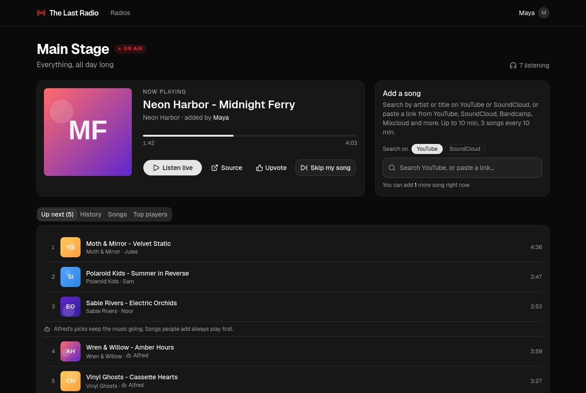

</div>

Search for a song by name, and it's on the playlist a moment later. Too many
sad songs? Vote it off. Queue running dry? Alfred, the station's fill-in DJ,
brings back the crowd's favourites. Run as many stations as you like (public,
private, open only in the evening), and let your AI assistant add songs for you.

---

## Features

### Listening together
- **One live stream per station**: everyone hears the same moment, like real radio (HLS through [mediamtx](https://github.com/bluenviron/mediamtx)).
- A **player that follows you** around the site, with remembered volume.
- **Seamless between songs**: silence fills the gaps, so the stream never drops; songs are loudness-normalised.
- **Live listener counts**.

### Adding songs
- **Search by artist or title on YouTube or SoundCloud**, straight from a dropdown, or **paste a link** from YouTube, SoundCloud, Bandcamp, Mixcloud and more.
- Picks from search are **added instantly**. Songs that can't be added say why (*On air now*, *Already in line*, *Over 10 min*).
- **Fair use per station**: each person can add N songs per window (say 3 per 10 minutes), with a friendly countdown.
- **Add again** from a station's history or song list.

### The crowd decides
- **Upvote** the song on air or any song in the history (3 a day): Alfred plays upvoted songs more.
- **Vote to skip**: when enough of the people *listening* downvote, the song goes. Whoever added a song can skip their own; admins skip anything.
- **Alfred, the fill-in DJ**: when less than 15 minutes is lined up, Alfred replays songs the station loved, weighted by a score (plays, people who added it, upvotes, downvotes, skips). He never brings back a song that was voted off, and people's picks always play first.
- **Song records** for every station: most played, crowd favourites, most downvoted, recently played; plus top players.
- A weekly **song health check** marks songs that disappeared from their site; *Find it* searches for another copy.

### Stations
- **As many stations as you want**, each with its own rules: song limits, maximum length, vote threshold, Alfred's threshold.
- **Broadcast hours** in the station's timezone (e.g. weekdays 8:00–18:00, or Friday nights 22:00–02:00). The song on air at closing finishes; the queue waits for the next opening.
- **Move a station** between radios (say, from a test server to the real one): *Export* saves its settings, access rules, queue, full history and votes to one file; *Import* recreates it elsewhere, matching people to their accounts by email.
- **Private stations** for a team or a family: add people by email, or let in everyone with a **confirmed** address at a domain (`@example.com`). The editor shows who each domain lets in, and who still has to confirm. Private audio is protected too, not just the page.
- **Listener stats**: how many people listen, counted every 5 minutes, for all stations and each one, over the last 24 hours, 7 days, 30 days or 3 months (average and peak). Counts only, never who.

### Your AI, your scripts
- **MCP server** at `/mcp`: ask Claude (or any MCP client) *"what's playing on Main Stage?"* or *"add some Daft Punk"*. Tools: `list_stations`, `now_playing`, `get_queue`, `song_stats`, `search_songs`, `add_song`, `upvote`, `downvote`, `undo_downvote`, `skip_my_song`.
- **OAuth 2.1** (PKCE, dynamic client registration, refresh rotation) so assistants sign in like people do, with a consent screen, or **API keys** with read-only or read-and-add scopes.
- **A documented REST API**: OpenAPI 3.1 at `/api/openapi.json`, browsable on the *Developers* page.

### Make it yours
- **Three themes**: *Night* (dark), *Light* and *Vintage* (an old wooden radio: sepia paper, walnut, an amber dial glow).
- **Profile photo** and display name. Uploads are re-encoded and stripped of metadata.
- **Feedback** straight to the admins (3 a day), who triage it: vote a priority, mark read, archive.
- **Email** confirmations, from any SMTP service or from a small mail server on your own host (SPF, DKIM, DMARC ready; see [`deploy/mail`](deploy/mail/README.md)). No address gets more than 3 emails in 30 minutes.

### Privacy and security, built in
- **No trackers, no ads, one sign-in cookie**, so no cookie banner; people acknowledge a clear privacy notice (French and English, written for GDPR and French law) when they sign up or when it changes.
- **Download my data** and **Delete my account** are self-service.
- Passwords hashed with salted **argon2id**; sessions, keys and tokens stored only as hashes.
- **Rate limits** on sign-in (per IP and per account), sign-up, OAuth, MCP, search and uploads; CSRF, SSRF and clickjacking protections; a strict Content-Security-Policy.

---

## Screenshots

| | |
|---|---|
| 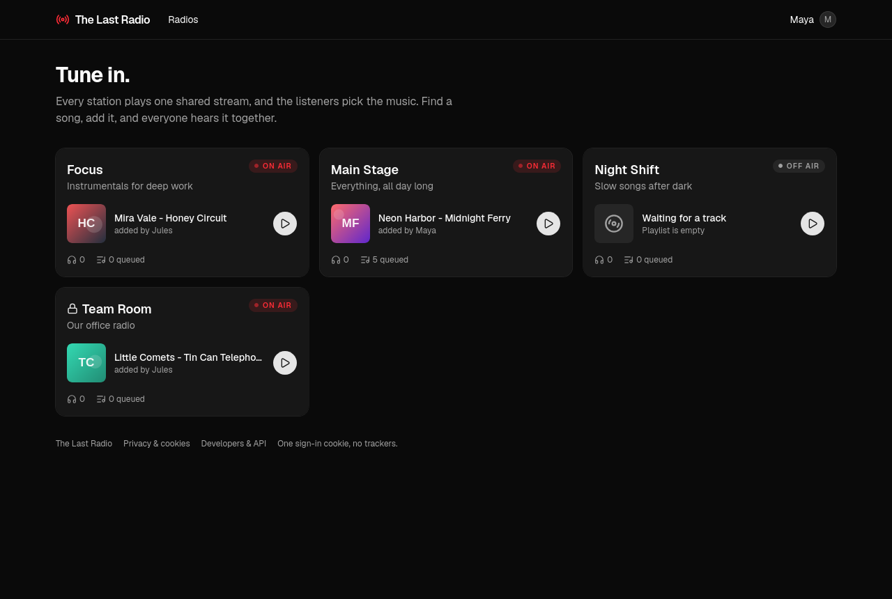 **Stations**: what's on everywhere, private ones marked with a lock. | 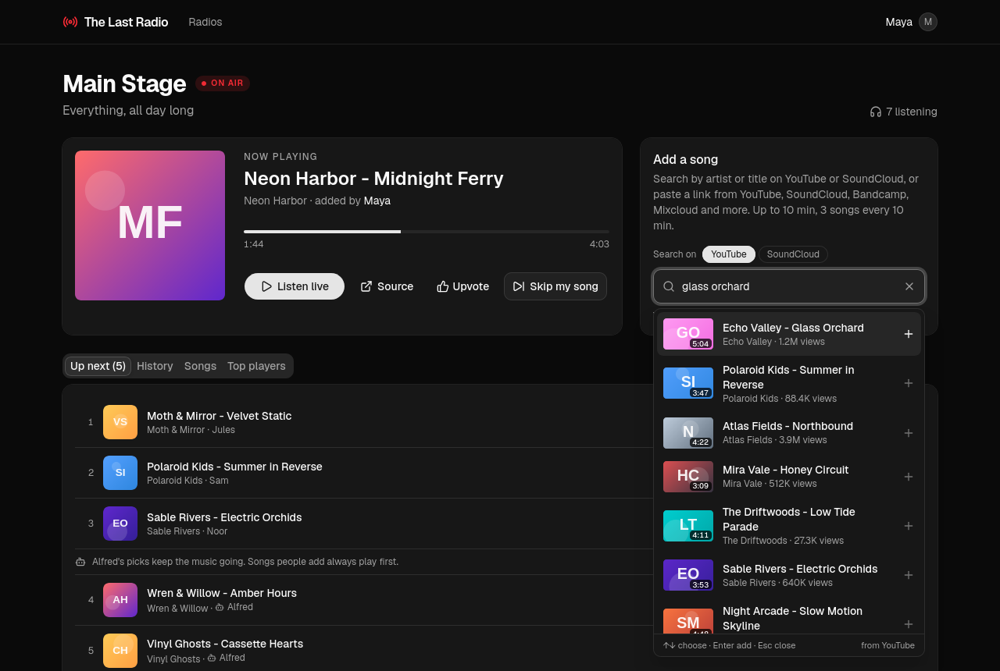 **Search**: find a song by name and add it in one click. |
| 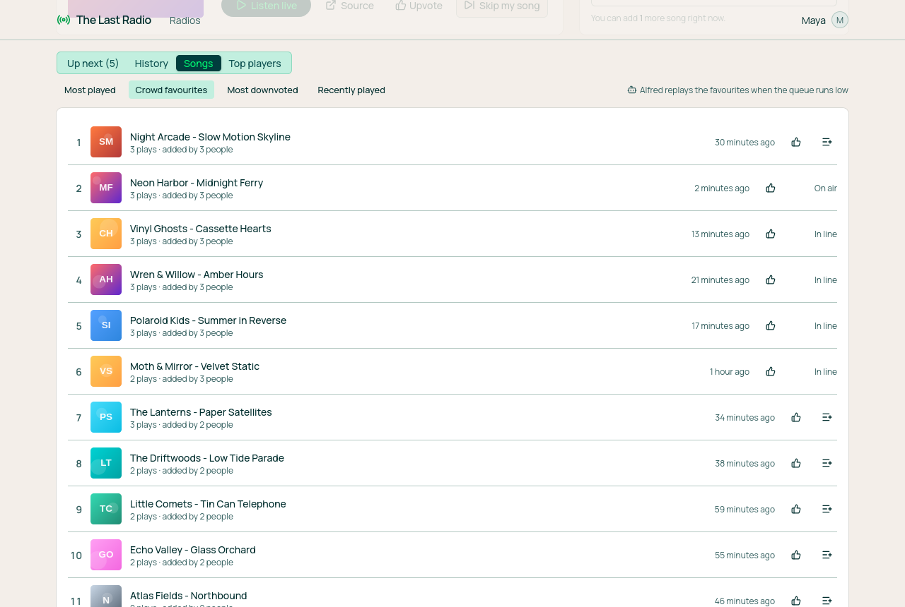 **Song records** in the *Light* theme: crowd favourites and why Alfred leaves a song alone. | 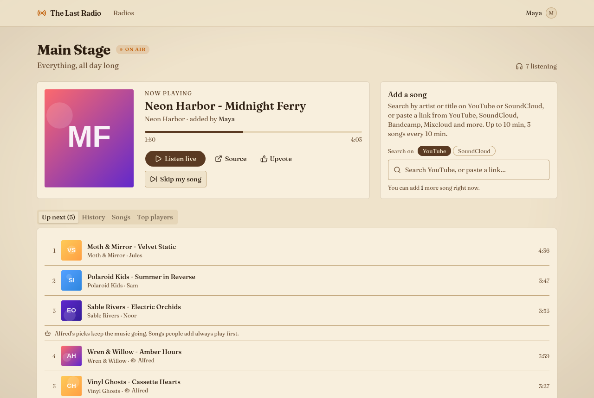 **The *Vintage* theme**. |
| 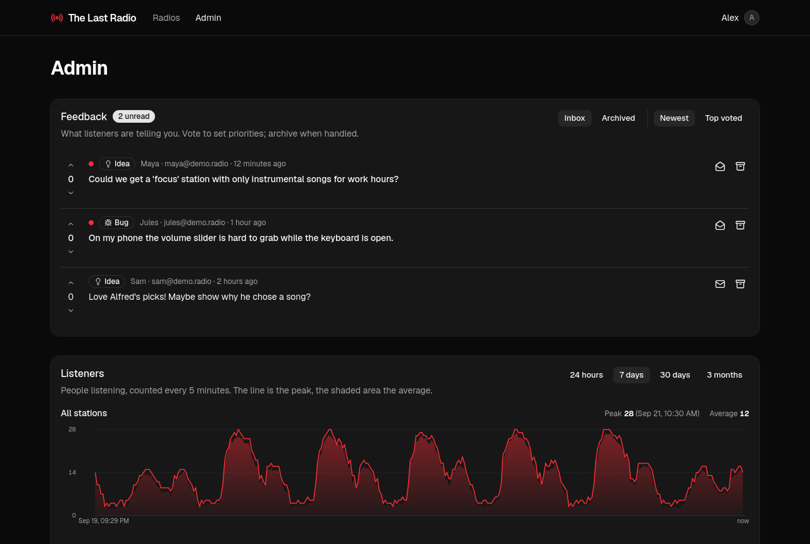 **Admin**: the feedback inbox and every station's rules. | 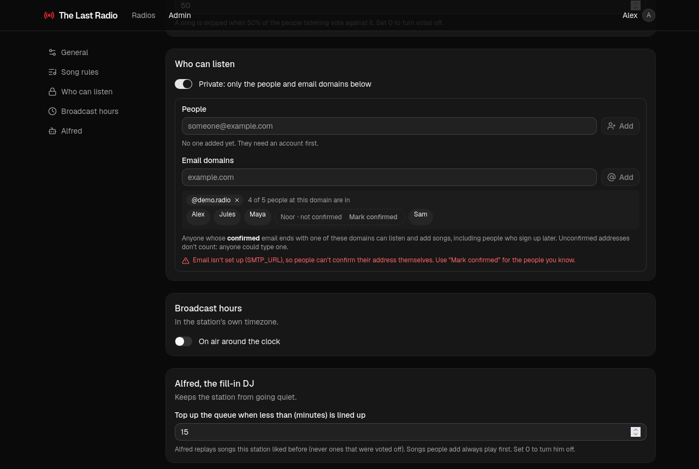 **The station editor**: who can listen (and who a domain lets in), hours, Alfred. |
| 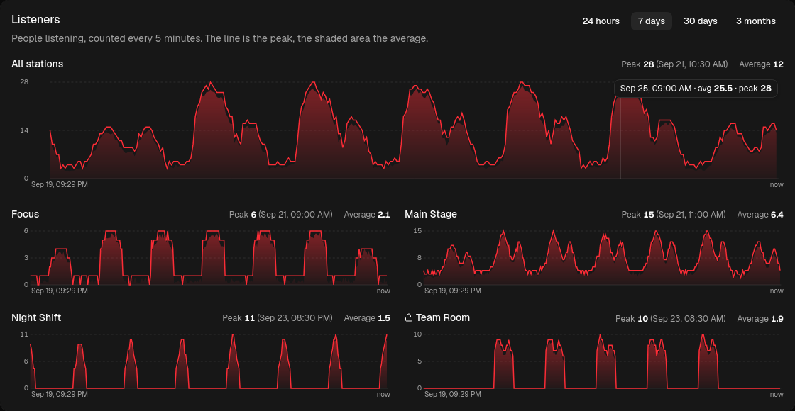 **Listener stats**: every station's audience, average and peak, up to 3 months back. | 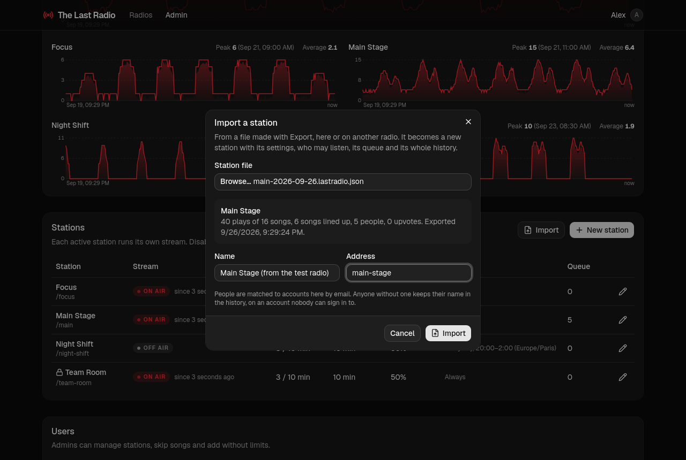 **Moving a station**: import a file exported on another radio, history and all. |
| 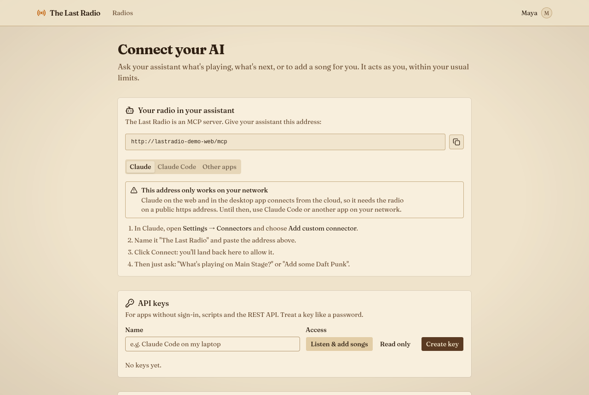 **Connect your AI**: the MCP address, API keys, connected apps. | 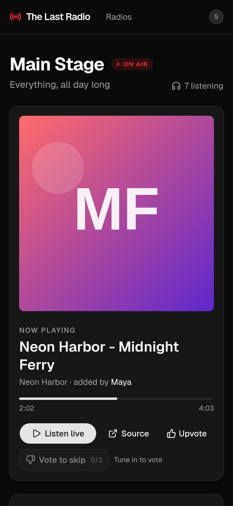 **On a phone**. |

<sub>Screenshots use invented artists, titles and artwork (see `e2e/docs/demo-data.ts`); regenerate them with `scripts/screenshots.sh`.</sub>

---

## Run it

You need Docker (with Compose).

```bash
git clone git@github.com:Slicit/the-last-radio.git && cd the-last-radio
cp .env.example .env        # set POSTGRES_PASSWORD at least
docker compose up -d --build
```

Open <http://localhost:28700>, **sign up: the first account becomes the admin**, then *Admin → New station*.

### Configuration (`.env`)

| Variable | Default | What it does |
|---|---|---|
| `POSTGRES_PASSWORD` | `change-me` | Database password. Set it. |
| `WEB_PORT` / `PG_PORT` | `28700` / `28732` | Host ports (Postgres only on localhost, for debugging). |
| `PUBLIC_URL` | derived | The public origin, e.g. `https://radio.example.com`. Needed behind a TLS proxy (OAuth, MCP). |
| `COOKIE_SECURE` | `false` | Set `true` when served over HTTPS. |
| `SMTP_URL` / `MAIL_FROM` | unset | Email for confirming addresses (private stations' domain rules). Without it, admins can mark people verified. |
| `MAIL_RETURN_PATH` | the From address | Where bounces go (the envelope sender SPF checks). To send from the host itself, see [`deploy/mail`](deploy/mail/README.md) and `docker-compose.mail.yml`. |
| `PRIVACY_CONTROLLER` / `PRIVACY_CONTACT` | unset | Who runs this radio and how to reach them, shown in the privacy notice. |
| `REGISTRATIONS_PER_HOUR` | `5` | Sign-ups allowed per IP per hour. |
| `SONG_CHECK_INTERVAL_DAYS` | `7` | How often each song is re-checked. |
| `YOUTUBE_PROXY` | unset | Send YouTube (only) through a proxy, e.g. `http://10.66.0.2:8888`, when YouTube blocks the server's address. See [`deploy/youtube-relay`](deploy/youtube-relay/README.md). |
| `SERVER_IMAGE` / `WEB_IMAGE` | built locally | Released images to run (see below). |

> **Claude on the web** reaches MCP servers from the cloud, so it needs the radio on a **public HTTPS** address (a reverse proxy or a tunnel). Claude Code and local clients work on your network as is.

### On a server, with HTTPS

[`deploy/traefik`](deploy/traefik/docker-compose.yml) is a shared [Traefik](https://traefik.io) proxy for the whole host: it owns ports 80/443, fetches Let's Encrypt certificates, and routes each domain to whichever Docker project claims it with labels, so the radio can sit next to your other sites.

```bash
docker network create traefik
(cd deploy/traefik && docker compose up -d)   # once per host; copy it anywhere, e.g. /opt/traefik
```

Then in the radio's `.env`:

```bash
COMPOSE_FILE=docker-compose.yml:docker-compose.traefik.yml
DOMAIN=radio.example.com
PUBLIC_URL=https://radio.example.com
COOKIE_SECURE=true
```

and `docker compose up -d --build`. Point the domain's DNS at the server first so the certificate can be issued.

### Email from your own server

[`deploy/mail`](deploy/mail/README.md) is a small Postfix for the host: it signs mail with DKIM, only sends for your domains, and only receives the few addresses you forward (bounces, postmaster, abuse). Its README lists the DNS records (SPF, DKIM, DMARC, MX, reverse DNS). Then in the radio's `.env`:

```bash
COMPOSE_FILE=docker-compose.yml:docker-compose.traefik.yml:docker-compose.mail.yml
SMTP_URL=smtp://postfix:587
MAIL_FROM=The Last Radio <radio@example.com>
MAIL_RETURN_PATH=bounces@example.com
```

### When YouTube blocks your server

Datacenter addresses often get "Sign in to confirm you're not a bot". Run [`deploy/youtube-relay`](deploy/youtube-relay/README.md) on a machine with an ordinary connection: it dials a WireGuard tunnel to the server and offers a proxy for YouTube only. Set `YOUTUBE_PROXY=http://10.66.0.2:8888`; other sites stay direct. Downloads that fail for a passing reason are retried later instead of dropping out of the queue.

### Updating without losing anything

```bash
scripts/deploy.sh           # build here and roll out
scripts/deploy.sh --pull    # or run released images (SERVER_IMAGE / WEB_IMAGE)
```

The deploy script **backs up the database first** (`backups/`, last 10 kept), then restarts one service at a time: the API (which applies any new migrations) and the web in seconds, then the broadcaster, which **lets the song on air finish**. Your data lives in the `lastradio-pgdata` volume, which updates never touch; migrations only ever move forward.

Releases: push a tag like `v1.2.0` and GitHub Actions publishes `ghcr.io/slicit/the-last-radio-server` and `-web` (`1.2.0`, `1.2`, `latest`).

---

## How it works

```
browser ──► web (nginx) ──/api, /mcp──► api (Hono) ──────► postgres
                │                          ▲
                └──/hls (checked by api)──► mediamtx ◄──RTSP── broadcaster
                                                               (yt-dlp + ffmpeg, Alfred, song checks)
```

| Service | Role |
|---|---|
| `web` | React + Vite + shadcn/ui, served by nginx; proxies the API and the audio. Every audio request is authorised by the API (private stations). |
| `api` | Hono + Drizzle (Postgres): accounts, stations, queue, votes, stats, feedback, OAuth, the MCP server and the OpenAPI document. Runs migrations. |
| `broadcaster` | One channel per open station: fetches songs ahead of time, decodes them, and feeds one continuous encoder at wall-clock rate. Runs Alfred and the weekly song checks. Drains gracefully on restart. |
| `mediamtx` | Takes RTSP from the broadcaster, serves HLS. |
| `postgres` | Everything that lasts. |

The playlist *is* the history: a queue item goes `queued → playing → played / skipped / failed`, so every statistic is a query, and Alfred learns from the same records people browse.

---

## Develop and test

```bash
npm install
npm run typecheck
scripts/test.sh             # unit + integration + end-to-end, in a throwaway stack
scripts/test.sh unit        # or one layer: unit | integration | e2e
```

- **Behaviour specs** live in [`specs/features`](specs/features) (Gherkin), one feature per journey. Tests reuse the scenario titles, so every behaviour points to the test that proves it.
- **Unit** and **integration** tests use Vitest; integration tests run the real API against Postgres. **End-to-end** tests drive the real app in Firefox with Playwright, including a real email round-trip through Mailpit.
- The test stack (`lastradio-test`) is a separate copy with its own containers, network, volumes and ports: tests never touch a running radio.
- CI (GitHub Actions) runs everything on each push, and refuses changes to released migrations.

Project rules for contributors, human or AI, are in [`CLAUDE.md`](CLAUDE.md), notably: **keep the privacy notice true** (a test fails when the database schema changes until the notice has been reviewed).

---

<sub>Songs are streamed from third-party sites with [yt-dlp](https://github.com/yt-dlp/yt-dlp). Restreaming music has licensing implications: keep your radio private, or play what you have the rights to.</sub>
